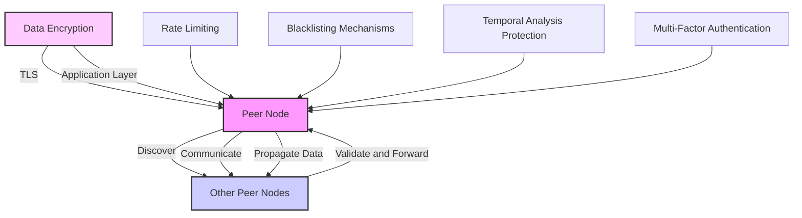
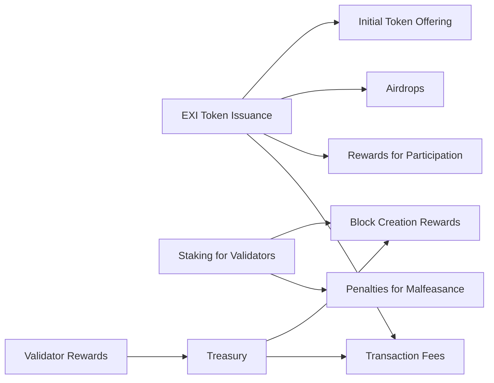
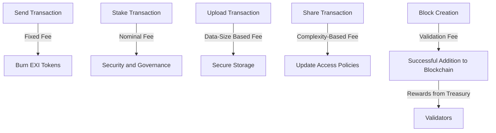
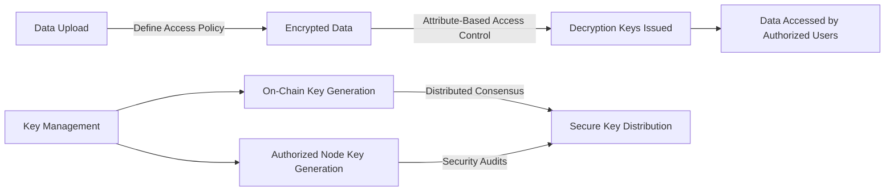
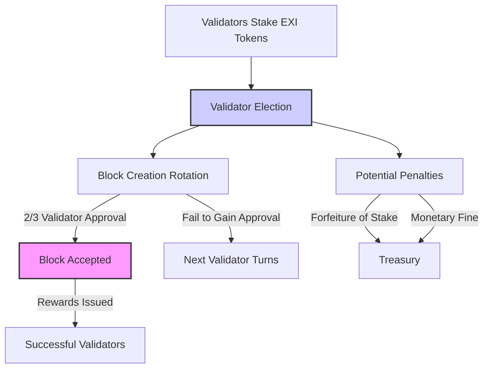

# ExInfo Blockchain Project Whitepaper

## Executive Summary

ExInfo is an innovative blockchain network designed to revolutionize information exchange while ensuring maximum security and decentralization. This whitepaper presents an in-depth look at ExInfo's infrastructure, focusing on its distinctive approach to transaction handling, data encryption, validator roles, and tokenomics. The decentralized yet regulated nature of ExInfo, combined with a robust economic model, ensures scalability and sustainability within the network. By leveraging blockchain technology, ExInfo is poised to facilitate secure and efficient information sharing across various sectors.

## Introduction

With the rise of digital information exchange, security and privacy concerns have increasingly become a priority. ExInfo addresses these issues by employing end-to-end encryption within a distributed ledger technology framework. By integrating the principles of blockchain with advanced encryption methods, ExInfo ensures that information remains secure and private, fostering a trustworthy environment for data sharing.

## 1. Network Architecture

### 1.1 Secure Distributed Ledgers

ExInfo operates on a decentralized network where each account is autonomous in managing its own ledger that records and reconciles transactions based on a sequential numbering system. This sequential numbering is critical, as it helps ensure transaction history is immutable and remains consistent across the network. Instead of relying solely on a central ledger, each node maintains and updates its copy, enhancing fault tolerance and system robustness.

### 1.2 Communication Between Nodes

Communication between nodes in the ExInfo network is orchestrated using a sophisticated peer-to-peer (P2P) protocol that allows for efficient data transmission without centralized oversight. Each node acts both as a client and a server within the larger network matrix, participating in data verification as well as propagation.

- **Peer Discovery:** Nodes discover each other using a combination of static configuration and dynamic discovery mechanisms. This hybrid approach ensures nodes can maintain connectivity even with dynamic network conditions.
- **Data Propagation:** To quickly and effectively spread transactions and data, nodes employ a gossip protocol that leverages the random selection of peers for communication, thereby decreasing the likelihood of network bottlenecks.

### 1.3 Cryptographic Communication

To achieve end-to-end encryption, ExInfo utilizes a dual-layer cryptographic approach:

- **Transport Layer Security:** For ensuring secure node-to-node communication, TLS is employed, establishing a secure channel over the network that prevents eavesdropping and tampering.
- **Application Layer Encryption:** Beyond TLS, application layer payloads, primarily transaction data, are encrypted using a combination of AES for symmetric encryption and RSA or ECC for asymmetric scenarios. This added layer ensures that even if TLS is compromised, the data remains secure against unauthorized access.

### 1.4 Advanced Security Mechanisms

In addition to encryption, ExInfo incorporates several other security measures to address common threats and ensure network resilience:

- **Rate Limiting and Throttling:** To mitigate denial-of-service (DoS) attacks, ExInfo nodes implement rate limiting, which controls the number of requests a single node can make to another within a certain timeframe. Throttling mechanisms also help in managing network traffic spikes.
- **Blacklisting:** Nodes that are found to be acting maliciously, such as those attempting to flood the network with spurious transactions or those that deviate from consensus rules, can be blacklisted by other nodes. This is enforced through a decentralized reputation system where nodes can vote to blacklist a peer based on observed behavior.
- **Temporal Analysis Protection:** To combat timing attacks where an attacker attempts to deduce encrypted values by analysing the time taken to execute cryptographic algorithms, ExInfo nodes use constant-time processing techniques. These techniques ensure that operations take the same amount of time to complete, regardless of the input size.
- **Multi-Factor Authentication (MFA):** For critical actions such as making transactions or changing sensitive account settings, multi-factor authentication is required to provide an additional layer of security.

By integrating these advanced and layered security measures within its network architecture, ExInfo ensures not only the privacy and confidentiality of communications but also robust defense against various cyber threats, providing a secure environment for decentralized information exchange.

## 2. Tokenomics

### 2.1 EXI Token Utilization

The EXI token is the core utility token within the ExInfo network, facilitating transaction processing and rewards distribution. Network transactions require EXI tokens for fees, which involves burning a small percentage of tokens, thereby introducing a deflationary pressure that potentially enhances the token's value as the network grows.

### 2.2 Validator Rewards and Staking

Validators are crucial to the network's maintenance and security, staking EXI tokens to participate in block creation. The staking mechanism guarantees a commitment to the network's operational integrity while aligning validators' incentives with the success of the network. Rewards are allocated in EXI tokens for successfully validated and accepted blocks, which motivates continuous participation and robust network performance.

### 2.3 Initial Token Offering (ITO)

To kickstart the project and facilitate initial funding, ExInfo will conduct an Initial Token Offering (ITO). This public sale will allow early adopters and investors to purchase EXI tokens at a predetermined rate. Funds raised through the ITO will support the ongoing development, marketing, and operational expenses of the network. The specifics of the offering, including token price, total supply available for the ITO, and purchase methods, will be outlined in a detailed prospectus available prior to the offering.

### 2.4 Community Building and Engagement

#### 2.4.1 Airdrops

To bolster community growth and reward early supporters, ExInfo will implement an airdrop campaign. This campaign will distribute EXI tokens to early adopters and active community members who meet certain criteria, such as engagement on social media, participation in network testing phases, or contributions to community forums and discussions. Airdrops are an effective tool for fostering a broad and diverse community around the ExInfo ecosystem.

#### 2.4.2 Rewards for Participation

ExInfo values active participation and contributions from its community. Various programs will be implemented to incentivize user involvement, including:

- **Beta Testing Rewards:** Users who participate in beta testing phases, providing valuable feedback and bug reports, will receive EXI tokens as a token of appreciation for their contributions to network stability and security.
- **Community Challenges:** Regularly scheduled competitions and challenges will be held, where participants can earn EXI tokens for creating apps, improving network code, or other useful contributions that enhance the ExInfo ecosystem.
- **Referral Programs:** To expand user base and network reach, a referral program will be established that rewards existing users with EXI tokens for successfully introducing new users to the ExInfo network.

### 2.5 Distribution and Supply Management

The total supply of EXI tokens will be capped, with specific allocations set aside for the ITO, community incentives, developer funds, and the founding team, subject to vesting periods and release schedules to ensure long-term alignment and commitment. Regular audits and transparency reports will be published to maintain trust and credibility in the management and distribution of EXI tokens.

## 3. Transaction Types and Fee Structures

ExInfo supports a versatile range of transaction types, each designed to fulfill specific roles within the network. To ensure network sustainability and motivate participation, each transaction type incorporates a defined fee structure. Here’s an overview of the main transactions types and their associated fees:

### 3.1 Send Transaction

- **Purpose:** Allows users to transfer EXI tokens from one account to another.
- **Fee:** A fixed fee applies to each Send transaction, which helps manage network congestion and covers the cost of transaction processing.

### 3.2 Stake Transaction

- **Purpose:** Enables users to stake EXI tokens to participate as validators in the network’s DPoS consensus mechanism.
- **Fee:** Staking involves a nominal fee that contributes to network security and governance processes.

### 3.3 Upload Transaction

- **Purpose:** Registers new sources of information on the network, protecting it through encryption.
- **Fee:** Uploading data incurs a fee based on the size and type of the data being uploaded, reflecting the cost of securely storing and managing access to the information.

### 3.4 Share Transaction

- **Purpose:** Alters the access policy attached to previously uploaded data, allowing for dynamic control over who can access information.
- **Fee:** Each Share transaction is subjected to a fee that correlates with the complexity and security demands of updating access policies.

### 3.5 Validator Block Creation

- **Purpose:** Validators create blocks containing batches of transactions, which are then added to the blockchain upon achieving consensus.
- **Fee:** Validators pay fees to propose blocks, which are reimbursed plus rewards if their block is successfully accepted into the blockchain. Penalties or loss of stake may occur for failing to achieve consensus or for malicious behavior.

### 3.6 Key Generation Request Transaction

- **Purpose:** Requests for key generation for decrypting protected data complying with specified access policies.
- **Fee:** This transaction type incurs a fee that covers the computational cost and security processes involved in generating and distributing decryption keys securely.

### Fee Waivers and Adjustments

ExInfo maintains mechanisms to adjust fees in response to network congestion, transaction types frequency, and broader economic factors within the network. Fee waivers or reductions can be occasionally implemented during promotional periods or for early adopters and substantial contributors to the network, fostering community growth and development.

### Contribution to Network Sustainability

Transaction fees are an essential aspect of the economic sustainability of the ExInfo network. Fees prevent spam, compensate validators and other network contributors, and provide a deflationary mechanism through token burning, which indirectly benefits token holders by potentially increasing the value of remaining tokens.

By structuring these fees transparently and aligning them with the actions that benefit the network most, ExInfo ensures that all users contribute fairly to the maintenance and enhancement of the network, promoting a balanced and effectively governed blockchain ecosystem.

## 4. Data Security and Access Management

### 4.1 Ciphertext-Policy Attribute-Based Encryption (CP-ABE)

ExInfo leverages CP-ABE to grant access to encrypted data, enabling data owners (uploaders) to define who can access their data based on a set of attributes and policies rather than specific identities. This encryption model enhances data security by allowing more granular, policy-driven access control.

### 4.2 Managing Access Through Policies and Attributes

The access control mechanism in ExInfo operates as follows:

- **Policy Creation:** When an account uploads new information to the network, they specify a set of policies determining how the data can be accessed. These policies are formulated based on attributes (such as the department in an organization, clearance level, or specific roles).

- **Attribute Assignment:** Attributes are assigned to other network participant accounts based on criteria established by the data owner or network protocol. Attributes can evolve over time, reflecting changes in status, roles, or qualifications of network participants.

- **Decryption Rights:** When an account wishes to access certain data, their attributes are evaluated against the ciphertext policy attached to the data. Access is granted only if the account's attributes satisfy the policy requirements, at which point decryption keys are issued to the requester.

This model not only keeps the data secure but also ensures compliance with data governance standards and policies, limiting access to sensitive information to authorized personnel only.

### 4.3 Safe Key Generation and Management

Key management is a critical aspect of maintaining the security integrity of the CP-ABE system. ExInfo handles key generation and distribution in two main ways:

- **On-Chain Key Generation:** For maximum security and decentralization, key generation can be done directly on the blockchain. This approach entails generating keys through a decentralized consensus among selected validators, ensuring no single point of failure can compromise the key's integrity. The distributed nature of this method also means that no single party has complete control over the key generation process, adding an extra layer of security.

- **Authorized Node Key Generation:** Alternatively, keys can be generated by specially authorized nodes that are entrusted with this task based on their proven security record and stake in the network. These nodes operate under strict protocol-enforced guidelines to prevent malfeasance or compromise. Moreover, the operation of these nodes is audited regularly, both programmatically and manually, to ensure they function within the designated security parameters.

In both cases, once keys are generated, they are encrypted and distributed securely to the rightful owners, ensuring that they are inaccessible to unauthorized parties during transit. Regular audits and updates to the cryptography algorithms used in key generation and encryption ensure that ExInfo stays ahead of potential security threats.

### 4.4 Enhanced Security Protocols

Additional security features implemented in ExInfo include:

- **Automatic Key Revocation:** In cases where an attribute changes or a policy is updated, the associated keys can be automatically revoked, and new keys are issued according to the current valid attributes and policies.
- **Multi-Factor Authentication for Key Access:** Requiring multiple factors of authentication before key issuance further secures access, ensuring that only validated users can acquire and use decryption keys.

By employing these sophisticated data security and access management protocols, ExInfo guarantees that all shared information within the network remains secure, confidential, and accessible only to authorized entities based on transparent and enforceable policies.

## 5. Consensus Protocol

The ExInfo network employs a Delegated Proof of Stake (DPoS) model for its consensus protocol, catering to a more democratic and efficient approach suited to the network's needs for high transaction throughput and security.

### 5.1 Delegated Proof of Stake Mechanism

In the DPoS system, network validators, also known as delegates, are elected by token holders who stake their EXI tokens as votes. Each token equates to one vote, and the more tokens a token holder stakes, the greater their voting power. This system not only democratizes the block validation process but also aligns the incentives of the validators with the interests of the token holders.

Validators are responsible for creating new blocks in the blockchain, and in return, they receive rewards in the form of EXI tokens. The opportunity to earn these rewards motivates validators to participate actively in the network's maintenance and security.

### 5.2 Validator Election and Block Creation

Once validators are elected, they are scheduled to propose blocks in a round-robin manner. Each validator has the chance to create a block at their designated turn. The proposed block must gather at least a 2/3 majority vote from other validators to be validated and added to the blockchain. If a validator fails to achieve this majority, the right to propose a block moves to the next validator in sequence.

### 5.3 Staking and Token Escrow

To become a validator, a significant amount of EXI tokens must be staked. These staked tokens are locked and held in escrow by a virtual treasury system specifically designed to enforce the conduct of validators. The staking process serves multiple roles:

- **Security Deposit:** The staked tokens act as a form of security deposit, incentivizing validators to comply with network rules and perform their duties honestly.
- **Random Selection for Block Creation:** The staked tokens increase the likelihood of being selected to propose a block. The more tokens staked, the higher the chance of being chosen in the validator rotation.

### 5.4 Penalties for Malfeasance

The ExInfo network takes validator malfeasance seriously. Any validator found guilty of bad behavior, such as proposing fraudulent transactions or attempting to attack the network, faces severe penalties:

- **Loss of Staked Tokens:** Depending on the severity of the violation, a validator may forfeit part or all of their staked tokens.
- **Monetary Fines:** For less severe offenses, validators might be required to pay fines, which are deducted directly from their staked holdings.

These penalties serve both as a deterrent against malicious activity and as a mechanism to compensate the network and its participants for any damage caused by such actions.

### 5.5 Reward Distribution

Successful block creation that achieves the required consensus (a 2/3 vote approval) results in rewards distributed to the respective validator from the virtual treasury. These rewards are meant to compensate validators for their efforts and expenses in maintaining network operations, including electricity, hardware, and time commitments.

This consensus protocol ensures that ExInfo operates securely and efficiently, with a governance structure that aligns the interests of various stakeholders and promotes a stable, reliable platform for information exchange.

## Conclusion

ExInfo presents a groundbreaking blockchain solution meticulously designed for secure and efficient information exchange across various sectors. Integral to achieving this vision is ExInfo's advanced network architecture and innovative transaction types, directly tailored to enhance data security and system integrity.

### Highlighting Core Features

1. **Network Architecture:** ExInfo's peer-to-peer model, enhanced by advanced cryptographic methods such as end-to-end encryption and secure on-chain key generation, ensures data confidentiality and integrity. Transparent communication protocols between nodes and rigorous security measures against potential attacks further solidify the network's robust structure.

2. **Consensus Protocol:** The implementation of a Delegated Proof of Stake (DPoS) consensus mechanism enriches network governance and provides a scalable method for transaction verification. This system not only democratizes voting but also fortifies network security by holding validators accountable through staking and potential penalties for misconduct.

3. **Dynamic Tokenomics and Fee Structures:** The EXI token serves as the backbone for all transactions within the ExInfo ecosystem. Through strategic token burning, staking, and detailed fee structures tied to each transaction type, the network ensures operational sustainability and incentivizes meaningful participation. Initiatives such as the Initial Token Offering, community airdrops, and rewards for network engagement underpin the network’s economic model, fostering long-term growth.

4. **Data Security and Access Management:** Utilizing Ciphertext-Policy Attribute-Based Encryption (CP-ABE), ExInfo guarantees that data access is managed securely and in accordance with predefined policies. Combined with safe, on-chain key generation mechanisms, the platform ensures that sensitive information is accessible only to authorized parties.

### Impact and Future Prospects

ExInfo's architecture is not just a technical framework but also a blueprint for a more secure, transparent, and efficient method of information exchange. By addressing key challenges such as data security, user privacy, and network scalability, ExInfo is poised to become a pivotal platform in the realm of secure digital communications.

As ExInfo continues to evolve, it will adapt to emerging technologies and market demands to further enhance its offerings. The commitment to continuous improvement and community-driven development sets ExInfo apart as a future-proof platform that is ready to meet the challenges of tomorrow's digital landscape.

In conclusion, ExInfo's comprehensive approach to blockchain technology showcases its potential to transform how information is shared securely and efficiently, making it a leading solution in the blockchain space and a promising model for future applications.
